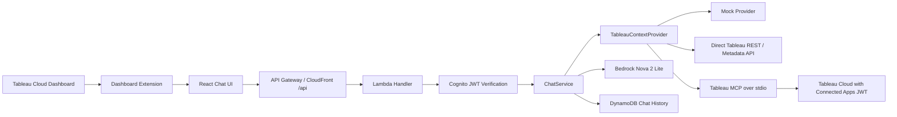

# Tableau Chat Assistant Extension PoC

## English

This PoC is a chat-style Tableau Dashboard Extension for Tableau Cloud. The React frontend captures dashboard context with the Tableau Extensions API, authenticates users with Cognito when enabled, and sends questions to an API Gateway + Lambda style backend.

The backend keeps Tableau access and secrets server-side. It can switch context providers with `TABLEAU_CONTEXT_PROVIDER`:

- `mock`: local-safe fallback with no Tableau call.
- `direct-api`: uses Tableau Connected Apps Direct Trust JWT to call Tableau REST API / Metadata API.
- `mcp`: launches Tableau MCP from the backend. The low-cost PoC path uses stdio transport inside Lambda instead of always-on ECS.

Answer generation can switch with `MODEL_PROVIDER`:

- `mock`: deterministic context-based answer.
- `bedrock`: Amazon Bedrock Converse API. The recommended visual-capable model for this PoC is Nova 2 Lite via `us.amazon.nova-2-lite-v1:0` in `us-east-1`.

### Architecture



### Local Development

Frontend:

```bash
cd frontend
npm install
npm run dev
```

Backend:

```bash
cd backend
npm install
npm run dev
```

Useful local defaults:

- Frontend: `http://localhost:5173`
- Backend: `http://localhost:3001`
- Chat API: `POST http://localhost:3001/chat`
- Health API: `GET http://localhost:3001/health`

For browser-only mock development outside Tableau:

```bash
VITE_USE_MOCK_TABLEAU=true
VITE_API_BASE_URL=http://localhost:3001
TABLEAU_CONTEXT_PROVIDER=mock
MODEL_PROVIDER=mock
```

### Tableau Extension

Use `frontend/public/tableau-chat-extension.trex` for local development, or the built `.trex` from `frontend/dist` after deployment.

The manifest `source-location` must point to the deployed HTTPS frontend URL. Tableau Cloud may require an administrator to allow network-enabled extensions and approve the extension domain.

### Authentication

Authentication is optional for local development and enabled with:

- Frontend: `VITE_AUTH_REQUIRED=true`
- Backend: `AUTH_REQUIRED=true`

Cognito frontend settings:

- `VITE_COGNITO_USER_POOL_ID`
- `VITE_COGNITO_CLIENT_ID`
- `VITE_COGNITO_REGION`
- `VITE_COGNITO_DOMAIN`
- `VITE_COGNITO_REDIRECT_URI`
- `VITE_COGNITO_LOGOUT_URI`

Cognito backend settings:

- `COGNITO_USER_POOL_ID`
- `COGNITO_CLIENT_ID`
- `COGNITO_REGION`

The backend verifies the Cognito JWT and derives the Tableau subject from the verified `email` claim. It does not trust a username sent by the frontend.

### Tableau Connected App Settings

The backend needs these values. Never put them in frontend code:

- `TABLEAU_SERVER_URL`
- `TABLEAU_SITE_CONTENT_URL`
- `TABLEAU_API_VERSION`
- `TABLEAU_CONNECTED_APP_CLIENT_ID`
- `TABLEAU_CONNECTED_APP_SECRET_ID`
- `TABLEAU_CONNECTED_APP_SECRET_VALUE`
- `TABLEAU_DEFAULT_SUBJECT`
- `TABLEAU_SCOPES`

In the low-cost AWS PoC deployment, the CloudFormation template passes Connected App values directly to Lambda environment variables. This avoids Secrets Manager fixed monthly cost, but anyone with permission to read Lambda function configuration may be able to view these values. For production, prefer SSM Parameter Store SecureString or Secrets Manager.

### MCP Settings

For Lambda-local Tableau MCP:

- `TABLEAU_CONTEXT_PROVIDER=mcp`
- `TABLEAU_MCP_TRANSPORT=stdio`
- `TABLEAU_MCP_AUTH_MODE=direct-trust`
- `TABLEAU_MCP_TIMEOUT_MS=5000`
- `TABLEAU_MCP_ALLOWED_TOOLS`: optional comma-separated allowlist of MCP tools to call.
- `TABLEAU_MCP_MAX_TOOL_CALLS=3`: increase to `5`-`8` when tool planning is enabled and datasource metadata/query tools are needed.
- `TABLEAU_MCP_DEBUG_LOG_RESULTS=false`: set to `true` only while diagnosing MCP result shapes in CloudWatch.
- `TABLEAU_MCP_TOOL_PLANNING_ENABLED=false`: set to `true` to let Bedrock create a small JSON MCP tool plan before tool execution.
- `TABLEAU_MCP_PLANNER_MAX_OUTPUT_TOKENS=600`: token cap for the planning call.
- `TABLEAU_MCP_COMMAND` and `TABLEAU_MCP_ARGS`: optional override. If omitted, Lambda runs the installed `@tableau/mcp-server` package with Node.js.

The MCP child process receives Connected App credentials only through backend environment variables. These values are not logged.

When MCP tool planning is enabled, the backend asks Bedrock to choose the smallest useful MCP tool set, validates it against an allowlist and schema checks, executes only approved tools, and then sends the resulting context to the final answer generator. Data-oriented questions may trigger one follow-up planning pass after datasource metadata is observed. Keep planner output small and avoid broad raw-data queries.

### Bedrock Settings

For the selected PoC model:

- `MODEL_PROVIDER=bedrock`
- `BEDROCK_REGION=us-east-1`
- `BEDROCK_MODEL_ID=us.amazon.nova-2-lite-v1:0`
- `BEDROCK_FOUNDATION_MODEL_ID=amazon.nova-2-lite-v1:0`
- `BEDROCK_MAX_OUTPUT_TOKENS=2400`
- `BEDROCK_TEMPERATURE=0.2`
- `CHAT_MEMORY_MESSAGE_LIMIT=10`

The current implementation sends text context to Bedrock. Screenshot/image input is the next step because Nova 2 Lite supports multimodal use cases, but the first implementation keeps data minimized.

### AWS Deployment

`.github/workflows/deploy-aws.yml` builds the backend and frontend, deploys `infra/cloudformation.yaml`, uploads frontend assets to S3, and invalidates CloudFront. Sensitive values should be stored in GitHub Secrets or repository Variables, and the workflow masks account-specific IDs and URLs in logs.

See [docs/github-actions-deployment.md](docs/github-actions-deployment.md).

### What Works

- Tableau Dashboard Extension UI with mock fallback.
- Cognito-protected chat API.
- Per-user Tableau subject derived from verified Cognito email.
- Direct Tableau REST / Metadata context lookup.
- Lambda-local Tableau MCP stdio provider.
- Bedrock Nova 2 Lite answer generator.
- DynamoDB chat history.
- GitHub Actions deployment to AWS.

### Not Production Ready Yet

- MCP tool selection is conservative and should be hardened with an explicit tool allowlist.
- Screenshot analysis is not wired into the prompt yet.
- Cognito email equals Tableau username is a PoC assumption.
- Production user mapping, IdP federation, audit logging, WAF, custom domains, and data governance need additional design.
- The Lambda artifact includes MCP runtime dependencies directly. A Lambda Layer or container image may be better if package size grows.

## 日本語

このPoCは、Tableau Cloud のダッシュボード内で動くチャット型 Dashboard Extension です。React フロントエンドが Tableau Extensions API でダッシュボード情報を取得し、必要に応じて Cognito でユーザー認証したうえで、API Gateway + Lambda 相当のバックエンドへ質問を送ります。

Tableau の Secret、JWT、MCP 認証情報、Bedrock 呼び出しはすべてバックエンド側で扱います。フロントエンドには置きません。

`TABLEAU_CONTEXT_PROVIDER` で Tableau コンテキスト取得方式を切り替えます。

- `mock`: Tableau API を呼ばないローカル開発向けの安全なフォールバックです。
- `direct-api`: Tableau Connected Apps Direct Trust JWT で REST API / Metadata API を呼びます。
- `mcp`: バックエンドから Tableau MCP を呼びます。PoCではコストを抑えるため、常時起動の ECS ではなく Lambda 内 stdio transport を優先します。

`MODEL_PROVIDER` で回答生成方式を切り替えます。

- `mock`: 取得済みコンテキストだけで決定的な回答を返します。
- `bedrock`: Amazon Bedrock Converse API を使います。今回の推奨は `us-east-1` の Nova 2 Lite inference profile `us.amazon.nova-2-lite-v1:0` です。

### ローカル起動

フロントエンド:

```bash
cd frontend
npm install
npm run dev
```

バックエンド:

```bash
cd backend
npm install
npm run dev
```

Tableau 外のブラウザでモック起動する場合:

```bash
VITE_USE_MOCK_TABLEAU=true
VITE_API_BASE_URL=http://localhost:3001
TABLEAU_CONTEXT_PROVIDER=mock
MODEL_PROVIDER=mock
```

### Tableau への配置

ローカルでは `frontend/public/tableau-chat-extension.trex` を使います。デプロイ後は `frontend/dist` に出力された `.trex` を使います。

`.trex` の `source-location` は HTTPS の本番フロントエンドURLに合わせる必要があります。Tableau Cloud 側で Network-enabled Extension の許可やドメイン許可が必要な場合があります。

### 認証

ローカル開発では認証なしでも動かせます。本番寄りにする場合は以下を有効にします。

- Frontend: `VITE_AUTH_REQUIRED=true`
- Backend: `AUTH_REQUIRED=true`

バックエンドは Cognito JWT を検証し、検証済みの `email` claim から Tableau subject を決定します。フロントエンドから送られたユーザー名は信用しません。

### Tableau MCP

Lambda 内で Tableau MCP を stdio 起動する場合の主な設定です。

- `TABLEAU_CONTEXT_PROVIDER=mcp`
- `TABLEAU_MCP_TRANSPORT=stdio`
- `TABLEAU_MCP_AUTH_MODE=direct-trust`
- `TABLEAU_MCP_TIMEOUT_MS=5000`
- `TABLEAU_MCP_ALLOWED_TOOLS`: 呼び出しを許可するMCP tool名のカンマ区切り。未指定時は安全に推測できる範囲だけ呼びます。
- `TABLEAU_MCP_MAX_TOOL_CALLS=3`
- `TABLEAU_MCP_DEBUG_LOG_RESULTS=false`: MCP の返却構造を CloudWatch で調査するときだけ `true` にします。

MCP 子プロセスには、バックエンドで検証済みの Tableau subject と Lambda 環境変数から取得した Connected App 情報だけを渡します。SecretやJWTはログに出しません。本番では SSM Parameter Store SecureString または Secrets Manager への移行を検討してください。

### Bedrock

今回の方針では、コストとスクリーンショット分析への拡張性を考えて以下を使います。

- `MODEL_PROVIDER=bedrock`
- `BEDROCK_REGION=us-east-1`
- `BEDROCK_MODEL_ID=us.amazon.nova-2-lite-v1:0`
- `BEDROCK_FOUNDATION_MODEL_ID=amazon.nova-2-lite-v1:0`
- `BEDROCK_MAX_OUTPUT_TOKENS=2400`
- `BEDROCK_TEMPERATURE=0.2`
- `CHAT_MEMORY_MESSAGE_LIMIT=10`

現時点ではテキスト化した Tableau コンテキストだけを送ります。スクリーンショット画像をBedrockへ渡す処理は次段階です。

### 現在できること

- Tableau Dashboard Extension UI の表示
- Cognito 認証付き chat API
- Cognito email を Tableau username とみなす PoC 方針
- REST / Metadata API による追加コンテキスト取得
- Lambda 内 stdio による Tableau MCP 呼び出し
- Bedrock Nova 2 Lite による回答生成
- DynamoDB へのチャット履歴保存
- GitHub Actions による AWS 自動デプロイ

### まだ本番利用できない理由

- Cognito email と Tableau username の一致はPoC前提です。本番ではIdP連携やユーザーマッピングが必要です。
- MCP tool の許可範囲は、明示的な allowlist でさらに絞る必要があります。
- スクリーンショット分析は未実装です。
- 監査ログ、WAF、独自ドメイン、データ最小化ルール、LLM利用ガードレールは追加設計が必要です。
- Lambda zip に MCP 実行依存を直接含めています。サイズが大きくなる場合は Lambda Layer またはコンテナ化を検討します。

詳しくは [docs/security-notes.md](docs/security-notes.md) と [docs/future-mcp-integration.md](docs/future-mcp-integration.md) を参照してください。

### 日本語追記: MCP Tool Planning

`TABLEAU_MCP_TOOL_PLANNING_ENABLED=true` にすると、チャット質問ごとに Bedrock が MCP tool の実行計画を JSON で作成します。バックエンドは、その計画をそのまま信用せず、`TABLEAU_MCP_ALLOWED_TOOLS` と引数検証を通過した tool だけを実行します。

データソースの中身や集計値を答えたい場合は、`TABLEAU_MCP_MAX_TOOL_CALLS` を `5` から `8` 程度に増やすことを推奨します。データ系の質問では datasource metadata 取得後に最大1回だけ再計画するため、計画用の Bedrock 呼び出しが増える場合があります。`TABLEAU_MCP_PLANNER_MAX_OUTPUT_TOKENS=600` 程度に抑え、広範な行レベルデータ取得は避けてください。
