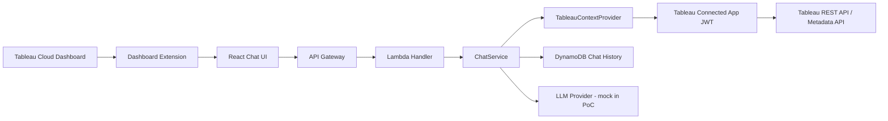

# Tableau Chat Assistant Extension PoC

## English

This is a PoC for a chat-style Tableau Dashboard Extension running inside Tableau Cloud dashboards. The React UI captures the current dashboard context through the Tableau Extensions API and sends user questions to a Node.js backend shaped like API Gateway + Lambda.

Answer generation is mocked for now. The backend depends on a `TableauContextProvider` interface, so the chat flow can switch between `DirectTableauApiContextProvider`, a future `TableauMcpContextProvider`, and `MockTableauContextProvider` without changing `ChatService`.

### Architecture



### Local Setup

Frontend:

```bash
cd frontend
npm install
npm run dev
```

Backend:

```bash
cd backend
npm install
npm run dev
```

Default local URLs:

- Frontend: `http://localhost:5173`
- Backend: `http://localhost:3001`
- Chat API: `POST http://localhost:3001/chat`
- Health API: `GET http://localhost:3001/health`

For browser-only mock development outside Tableau:

```bash
VITE_USE_MOCK_TABLEAU=true
VITE_API_BASE_URL=http://localhost:3001
```

### Loading As A Tableau Extension

Use `frontend/public/tableau-chat-extension.trex` when adding a Dashboard Extension in Tableau Desktop or Tableau Cloud.

The local manifest points to `http://localhost:5173/`. For production, host the built frontend on HTTPS and update the `.trex` `source-location` URL.

Depending on Tableau Cloud / Server settings, an administrator may need to allow network-enabled extensions and approve the extension domain.

### Tableau Connected App Values

The backend needs these values to sign in to Tableau REST API with Direct Trust JWT. Never put secret values in the frontend.

- `TABLEAU_SERVER_URL`: for example `https://prod-useast-a.online.tableau.com`
- `TABLEAU_SITE_CONTENT_URL`: Tableau site content URL, sometimes empty for the default site
- `TABLEAU_API_VERSION`: for example `3.25`
- `TABLEAU_CONNECTED_APP_CLIENT_ID`
- `TABLEAU_CONNECTED_APP_SECRET_ID`
- `TABLEAU_CONNECTED_APP_SECRET_VALUE`
- `TABLEAU_DEFAULT_SUBJECT`: Tableau Cloud user email for the PoC
- `TABLEAU_SCOPES`: comma-separated, defaults to `tableau:content:read`
- `TABLEAU_CONTEXT_PROVIDER`: defaults to `mock`; use `direct` to call Tableau APIs

Chat history settings:

- `USE_IN_MEMORY_REPOSITORY=true`: use memory storage for local development
- `CHAT_HISTORY_TABLE_NAME`: DynamoDB table name
- `CORS_ALLOWED_ORIGIN`: restrict to the frontend origin in deployed environments

### What Works In This PoC

- React + TypeScript + Vite Dashboard Extension UI
- Tableau Extensions API initialization with mock fallback
- Dashboard context capture for dashboard name, worksheets, filters, parameters, selected marks, and datasources where available
- Chat UI sending questions to `/chat`
- Lambda-style backend handlers and local HTTP server
- Tableau Connected Apps Direct Trust JWT generation
- Tableau REST API sign-in client structure
- Metadata API GraphQL client structure
- DynamoDB repository and local in-memory repository
- Mock answer generation behind an `AnswerGenerator` interface
- Basic AWS auto-deployment through GitHub Actions

### Not Yet Implemented

- Real LLM integration with OpenAI, Bedrock, or another provider
- Production user authentication between frontend and backend
- Application-user to Tableau-user mapping for multi-user deployments
- Complete workbook LUID discovery from dashboard context
- Full Metadata API model for workbook -> dashboard -> sheets -> datasources -> fields
- Production-grade AWS additions such as custom domains, WAF, and audit logging

### GitHub Actions AWS Deployment

`.github/workflows/deploy-aws.yml` and `infra/cloudformation.yaml` provide automated AWS deployment.

The workflow assumes an AWS role through GitHub OIDC, bundles backend Lambda code, deploys CloudFormation, uploads the frontend to S3, and invalidates CloudFront.

To reduce log exposure, ARNs containing AWS account IDs, S3 bucket names, CloudFront/API URLs, Tableau URLs, Connected App values, and Tableau user names are expected to be stored in GitHub Secrets. The workflow also uses `::add-mask::`, `mask-aws-account-id: true`, and avoids CloudFormation Outputs for URLs or physical IDs.

See [docs/github-actions-deployment.md](docs/github-actions-deployment.md).

### Future MCP Integration

The chat flow depends only on `TableauContextProvider`. Today, `DirectTableauApiContextProvider` calls REST API / Metadata API directly.

A future `TableauMcpContextProvider` can be added so `ChatService` can use Tableau MCP without code changes. Confirm whether Tableau MCP supports Connected Apps JWT first. If not, continue direct REST API / Metadata API calls for production Tableau access.

See [docs/future-mcp-integration.md](docs/future-mcp-integration.md).

## 日本語

これは Tableau Cloud のダッシュボード内で動作する、チャット型 Tableau Dashboard Extension の PoC です。React UI が Tableau Extensions API から現在のダッシュボード情報を取得し、API Gateway + Lambda 相当の Node.js バックエンドへユーザーの質問を送信します。

回答生成は現時点ではモックです。バックエンドは `TableauContextProvider` インターフェースに依存する設計にしており、`DirectTableauApiContextProvider`、将来追加する `TableauMcpContextProvider`、`MockTableauContextProvider` を `ChatService` から透過的に差し替えられます。

### アーキテクチャ


### ローカル起動

フロントエンド:

```bash
cd frontend
npm install
npm run dev
```

バックエンド:

```bash
cd backend
npm install
npm run dev
```

デフォルトのローカルURL:

- フロントエンド: `http://localhost:5173`
- バックエンド: `http://localhost:3001`
- Chat API: `POST http://localhost:3001/chat`
- Health API: `GET http://localhost:3001/health`

Tableau 外のブラウザでモック開発する場合:

```bash
VITE_USE_MOCK_TABLEAU=true
VITE_API_BASE_URL=http://localhost:3001
```

### Tableau Extension として読み込む方法

Tableau Desktop または Tableau Cloud で Dashboard Extension を追加するときに、`frontend/public/tableau-chat-extension.trex` を指定します。

ローカル用の manifest は `http://localhost:5173/` を参照します。本番では、ビルド済みフロントエンドを HTTPS でホストし、`.trex` の `source-location` URL を本番URLへ変更してください。

Tableau Cloud / Server の設定によっては、管理者が Network-enabled Extension を許可し、Extension のドメインを許可リストへ追加する必要があります。

### Tableau Connected App 設定値

Direct Trust JWT で Tableau REST API にサインインするため、バックエンドには以下の値が必要です。Secret 値は絶対にフロントエンドへ置かないでください。

- `TABLEAU_SERVER_URL`: 例 `https://prod-useast-a.online.tableau.com`
- `TABLEAU_SITE_CONTENT_URL`: Tableau site content URL。既定サイトでは空文字になる場合があります。
- `TABLEAU_API_VERSION`: 例 `3.25`
- `TABLEAU_CONNECTED_APP_CLIENT_ID`
- `TABLEAU_CONNECTED_APP_SECRET_ID`
- `TABLEAU_CONNECTED_APP_SECRET_VALUE`
- `TABLEAU_DEFAULT_SUBJECT`: PoC では Tableau Cloud ユーザーのメールアドレスを想定
- `TABLEAU_SCOPES`: カンマ区切り。既定は `tableau:content:read`
- `TABLEAU_CONTEXT_PROVIDER`: 既定は `mock`。Tableau API を呼ぶ場合は `direct`

チャット履歴保存用の設定:

- `USE_IN_MEMORY_REPOSITORY=true`: ローカル開発ではメモリ保存を使う
- `CHAT_HISTORY_TABLE_NAME`: DynamoDB のテーブル名
- `CORS_ALLOWED_ORIGIN`: デプロイ環境ではフロントエンドの Origin に制限する

### このPoCでできること

- React + TypeScript + Vite の Dashboard Extension UI
- Tableau Extensions API の初期化とモックフォールバック
- ダッシュボード名、ワークシート、フィルター、パラメーター、選択マーク、データソース情報の取得
- チャットUIから `/chat` API への質問送信
- Lambda 形式のバックエンドハンドラーとローカルHTTPサーバー
- Tableau Connected Apps Direct Trust JWT の生成
- Tableau REST API sign-in クライアント構造
- Metadata API GraphQL クライアント構造
- DynamoDB Repository とローカル用 In-memory Repository
- `AnswerGenerator` インターフェース越しのモック回答生成
- GitHub Actions から AWS へ自動デプロイするための基本構成

### まだできないこと

- OpenAI / Bedrock などの実LLM連携
- フロントエンドとバックエンド間の本番用ユーザー認証
- 複数ユーザー対応時のアプリユーザーと Tableau ユーザーの対応付け
- ダッシュボードコンテキストからの完全な workbook LUID 特定
- workbook -> dashboard -> sheets -> datasources -> fields までの完全な Metadata API モデル化
- 独自ドメイン、WAF、監査ログなどを含む本番運用向けAWS構成

### GitHub Actions によるAWSデプロイ

`.github/workflows/deploy-aws.yml` と `infra/cloudformation.yaml` で、AWS への自動デプロイ構成を用意しています。

ワークフローは GitHub OIDC で AWS ロールを Assume し、バックエンドの Lambda bundle、CloudFormation デプロイ、フロントエンドの S3 配置、CloudFront invalidation を実行します。

ログ露出を抑えるため、AWSアカウントIDを含むARN、S3 bucket名、CloudFront/API URL、Tableau URL、Connected App 情報、Tableau ユーザー名などは GitHub Secrets に置く前提です。Actions 内でも `::add-mask::` と `mask-aws-account-id: true` を使い、CloudFormation Outputs にはURLや物理IDを出さない設計にしています。

詳しくは [docs/github-actions-deployment.md](docs/github-actions-deployment.md) を参照してください。

### 今後のMCP統合方針

チャット処理は `TableauContextProvider` だけに依存しています。現在は REST API / Metadata API を直接呼ぶ `DirectTableauApiContextProvider` を用意しています。

将来的には `TableauMcpContextProvider` を追加することで、`ChatService` を変更せずに Tableau MCP 経由の情報取得へ差し替えられる想定です。ただし、Tableau MCP 側が Connected Apps JWT に対応しているかは確認が必要です。対応していない場合は、REST API / Metadata API の直呼びを継続します。

詳細は [docs/future-mcp-integration.md](docs/future-mcp-integration.md) を参照してください。

