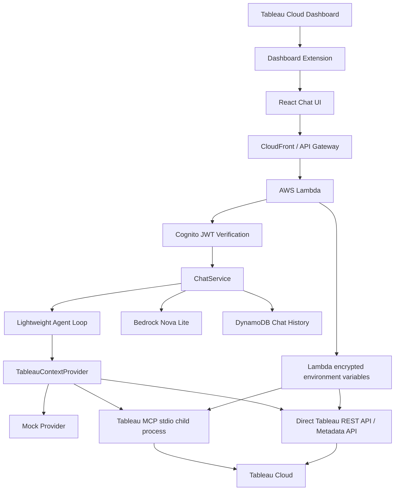
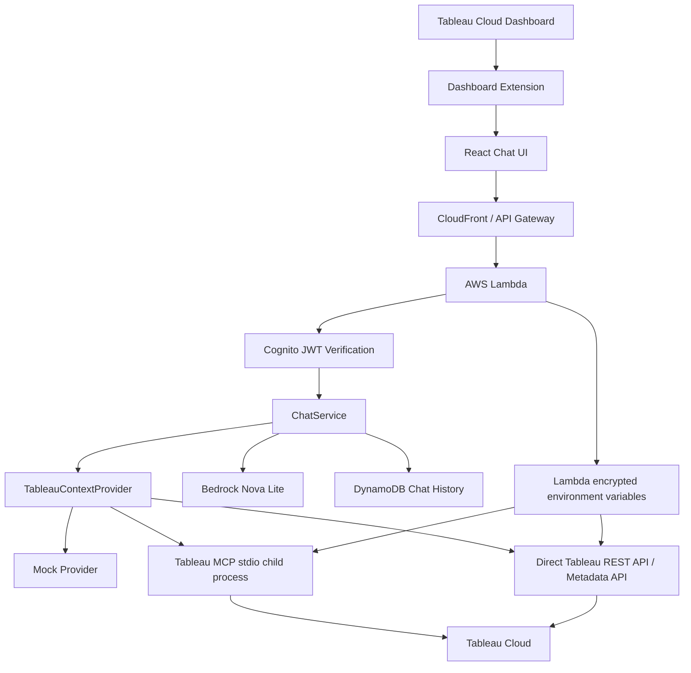

# Architecture / アーキテクチャ

## English

### Runtime Flow

1. Tableau loads the `.trex` manifest and opens the React app as a Dashboard Extension.
2. The React app initializes the Tableau Extensions API and captures dashboard metadata.
3. If authentication is required, the user signs in with Cognito Hosted UI.
4. The frontend sends `POST /chat` with dashboard context and a Cognito token.
5. Lambda verifies the Cognito JWT and derives the Tableau subject from the verified email claim.
6. `ChatService` optionally runs a lightweight agent loop that rewrites ambiguous questions into a clearer investigation question, then evaluates whether one more context pass is needed.
7. `mock` returns local test context, `direct-api` calls Tableau REST / Metadata API, and `mcp` launches Tableau MCP over stdio.
8. The Tableau MCP provider still enforces the allowlist, timeout, and identifier guardrails for actual tool execution.
9. `AnswerGenerator` either returns a deterministic context answer or calls Bedrock Nova Lite.
10. Chat history is saved to DynamoDB.

### Key Abstractions

- `TableauContextProvider`: hides whether Tableau context came from REST API, Metadata API, MCP, or mocks.
- `Lightweight Agent Loop`: adds question normalization, evidence sufficiency evaluation, and at most one extra context retrieval pass without introducing a large framework.
- `AnswerGenerator`: hides whether answers come from deterministic mock logic or Bedrock.
- `ChatHistoryRepository`: hides whether history is saved in DynamoDB or memory.

## 日本語

### 実行時の流れ

1. Tableau が `.trex` manifest を読み込み、React アプリを Dashboard Extension として開きます。
2. React アプリが Tableau Extensions API を初期化し、ダッシュボードメタデータを取得します。
3. 認証が必要な場合、ユーザーは Cognito Hosted UI でサインインします。
4. フロントエンドが dashboard context と Cognito token を付けて `POST /chat` を呼びます。
5. Lambda が Cognito JWT を検証し、検証済み email claim から Tableau subject を決定します。
6. `ChatService` が選択された `TableauContextProvider` に追加コンテキスト取得を依頼します。
7. `mock` はローカル用コンテキストを返し、`direct-api` は Tableau REST / Metadata API を呼び、`mcp` は Tableau MCP を stdio で起動します。
8. `AnswerGenerator` が決定的なコンテキスト回答、または Bedrock Nova Lite による回答を返します。
9. チャット履歴を DynamoDB に保存します。

### 主要な抽象化

- `TableauContextProvider`: Tableau コンテキスト取得元が REST API、Metadata API、MCP、mock のどれかを隠蔽します。
- `AnswerGenerator`: 回答生成元が mock ロジックか Bedrock かを隠蔽します。
- `ChatHistoryRepository`: 履歴保存先が DynamoDB かメモリかを隠蔽します。
