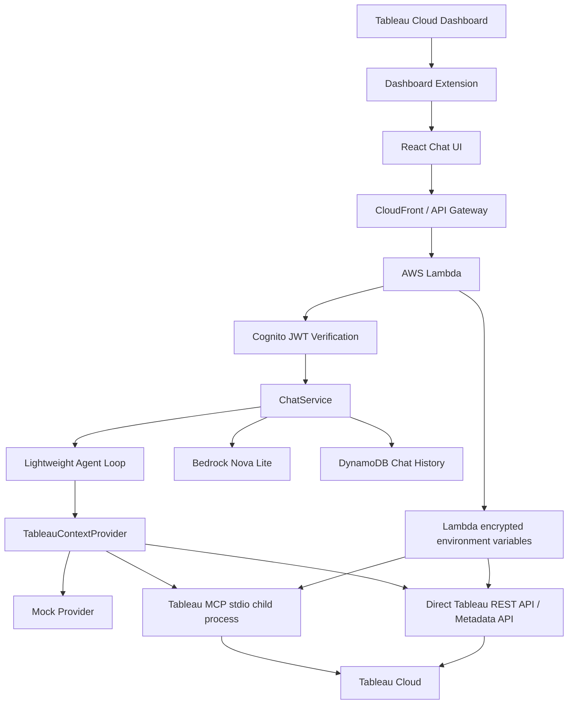
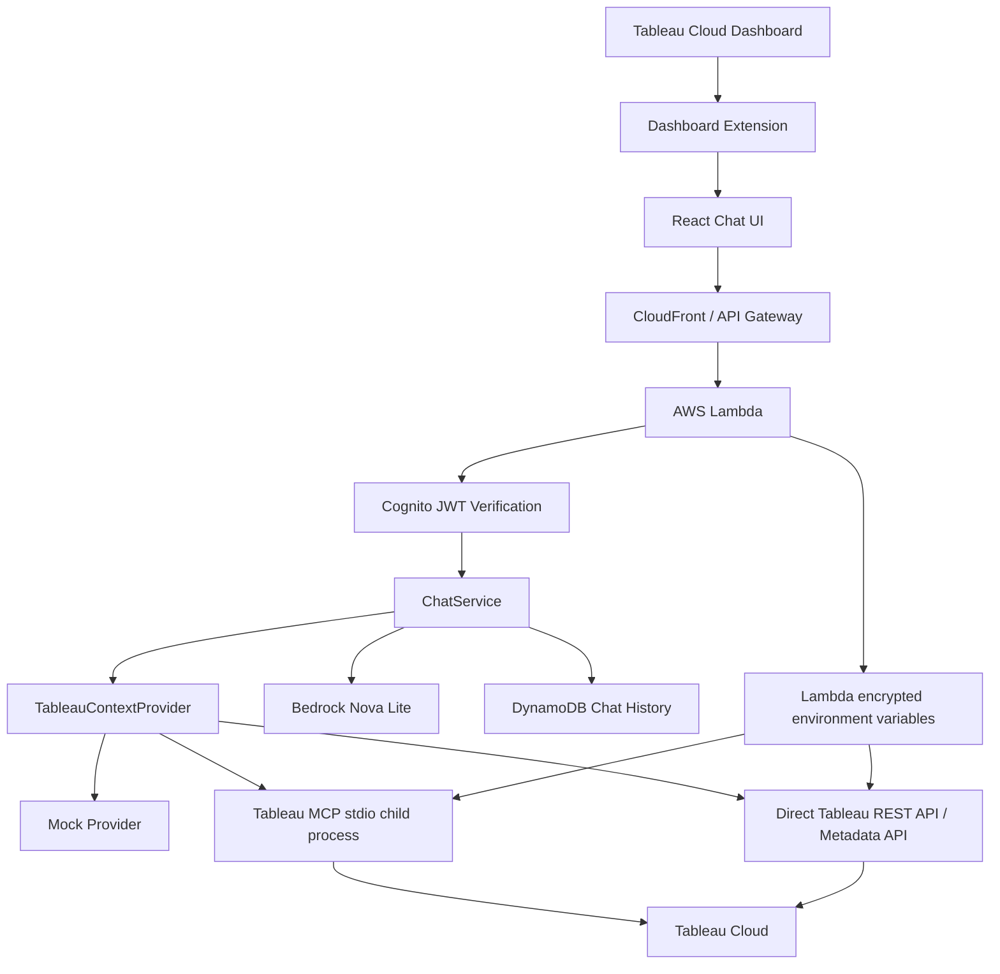

# Architecture / 繧｢繝ｼ繧ｭ繝・け繝√Ε

## English

### Runtime Flow

1. Tableau loads the `.trex` manifest and opens the React app as a Dashboard Extension.
2. The React app initializes the Tableau Extensions API and captures dashboard metadata.
3. If authentication is required, the user signs in with Cognito Hosted UI.
4. The frontend sends `POST /chat-jobs` with dashboard context and a Cognito token, then polls `GET /chat-jobs/{jobId}` until completion.
5. Lambda verifies the Cognito JWT and derives the Tableau subject from the verified email claim.
6. The job starter writes a DynamoDB record, returns `jobId` immediately, and dispatches a worker Lambda asynchronously.
7. The worker runs `ChatService`, which optionally runs a lightweight agent loop that rewrites ambiguous questions into a clearer investigation question, then evaluates whether one more context pass is needed.
8. `mock` returns local test context, `direct-api` calls Tableau REST / Metadata API, and `mcp` launches Tableau MCP over stdio.
9. The Tableau MCP provider still enforces the allowlist, timeout, and identifier guardrails for actual tool execution.
10. `AnswerGenerator` either returns a deterministic context answer or calls Bedrock Nova Lite.
11. Chat history and job progress are saved to DynamoDB.

### Key Abstractions

- `TableauContextProvider`: hides whether Tableau context came from REST API, Metadata API, MCP, or mocks.
- `Lightweight Agent Loop`: adds question normalization, evidence sufficiency evaluation, and at most one extra context retrieval pass without introducing a large framework.
- `AnswerGenerator`: hides whether answers come from deterministic mock logic or Bedrock.
- `ChatHistoryRepository`: hides whether history is saved in DynamoDB or memory.

## 譌･譛ｬ隱・

### 螳溯｡梧凾縺ｮ豬√ｌ

1. Tableau 縺・`.trex` manifest 繧定ｪｭ縺ｿ霎ｼ縺ｿ縲ヽeact 繧｢繝励Μ繧・Dashboard Extension 縺ｨ縺励※髢九″縺ｾ縺吶�・
2. React 繧｢繝励Μ縺・Tableau Extensions API 繧貞・譛溷喧縺励�√ム繝・す繝･繝懊・繝峨Γ繧ｿ繝・・繧ｿ繧貞叙蠕励＠縺ｾ縺吶�・
3. 隱崎ｨｼ縺悟ｿ・ｦ√↑蝣ｴ蜷医�√Θ繝ｼ繧ｶ繝ｼ縺ｯ Cognito Hosted UI 縺ｧ繧ｵ繧､繝ｳ繧､繝ｳ縺励∪縺吶�・
4. 繝輔Ο繝ｳ繝医お繝ｳ繝峨′ dashboard context 縺ｨ Cognito token 繧剃ｻ倥¢縺ｦ `POST /chat-jobs` 繧貞他縺ｳ縺ｾ縺吶�・
5. Lambda 縺・Cognito JWT 繧呈､懆ｨｼ縺励�∵､懆ｨｼ貂医∩ email claim 縺九ｉ Tableau subject 繧呈ｱｺ螳壹＠縺ｾ縺吶�・
6. `ChatService` 縺碁∈謚槭＆繧後◆ `TableauContextProvider` 縺ｫ霑ｽ蜉�繧ｳ繝ｳ繝・く繧ｹ繝亥叙蠕励ｒ萓晞�ｼ縺励∪縺吶�・
7. `mock` 縺ｯ繝ｭ繝ｼ繧ｫ繝ｫ逕ｨ繧ｳ繝ｳ繝・く繧ｹ繝医ｒ霑斐＠縲〜direct-api` 縺ｯ Tableau REST / Metadata API 繧貞他縺ｳ縲〜mcp` 縺ｯ Tableau MCP 繧・stdio 縺ｧ襍ｷ蜍輔＠縺ｾ縺吶�・
8. `AnswerGenerator` 縺梧ｱｺ螳夂噪縺ｪ繧ｳ繝ｳ繝・く繧ｹ繝亥屓遲斐�√∪縺溘・ Bedrock Nova Lite 縺ｫ繧医ｋ蝗樒ｭ斐ｒ霑斐＠縺ｾ縺吶�・
9. 繝√Ε繝・ヨ螻･豁ｴ繧・DynamoDB 縺ｫ菫晏ｭ倥＠縺ｾ縺吶�・

### 荳ｻ隕√↑謚ｽ雎｡蛹・

- `TableauContextProvider`: Tableau 繧ｳ繝ｳ繝・く繧ｹ繝亥叙蠕怜・縺・REST API縲｀etadata API縲｀CP縲［ock 縺ｮ縺ｩ繧後°繧帝國阡ｽ縺励∪縺吶�・
- `AnswerGenerator`: 蝗樒ｭ皮函謌仙・縺・mock 繝ｭ繧ｸ繝・け縺・Bedrock 縺九ｒ髫�阡ｽ縺励∪縺吶�・
- `ChatHistoryRepository`: 螻･豁ｴ菫晏ｭ伜・縺・DynamoDB 縺九Γ繝｢繝ｪ縺九ｒ髫�阡ｽ縺励∪縺吶�・
