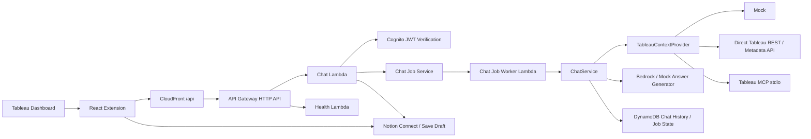

# アーキテクチャ

## 概要

このリポジトリは、Tableau ダッシュボード上で動くチャット拡張を中心に、フロントエンド、API、AWS、Tableau 連携、Notion 連携をまとめています。

実装済みの主要な外部連携は Tableau、Cognito、Amazon Bedrock、Notion です。  
Slack、Bluesky、Google Calendar、画像アップロード/画像解析は現在のコードベースでは確認できません。

## 全体フロー

## 主要な処理フロー

1. Tableau が `.trex` を読み込み、React Extension を起動します。
2. フロントエンドが Tableau Extensions API からダッシュボード文脈を取得します。
3. `AUTH_REQUIRED=true` の場合、フロントエンドは Cognito でサインインし、ID トークンをバックエンドに送ります。
4. フロントエンドは `POST /chat-jobs` で質問を送信します。
5. バックエンドはジョブを DynamoDB に作成し、必要に応じて worker Lambda に処理を委譲します。
6. `ChatService` が Tableau 文脈を取得し、必要なら軽量エージェントで再質問を行い、回答を生成します。
7. 回答は mock または Bedrock から返ります。
8. 条件を満たすと Notion 用の下書きが生成され、フロントエンドで保存確認を行えます。

## データの流れ

- フロントエンドはダッシュボードの基本文脈を保持します。
- `POST /context` で workbook 名などを補完できます。
- `POST /chat-jobs` と `GET /chat-jobs/{jobId}` で非同期ジョブを扱います。
- 会話履歴は DynamoDB かメモリリポジトリに保存されます。
- `X-Chat-Owner-Token` は匿名利用時の閲覧境界に使われます。
- Notion 連携は、接続状態の確認、OAuth 接続、保存前プレビュー、保存という順で進みます。

## 認証・権限

- Cognito 認証は任意です。
- `AUTH_REQUIRED=true` のとき、バックエンドは Cognito JWT を検証します。
- Tableau の subject は、認証済みユーザーの email claim から決められます。
- email が使えない場合のフォールバックとして `TABLEAU_DEFAULT_SUBJECT` を使えます。
- Tableau MCP は allowlist、timeout、引数サニタイズ、最大呼び出し回数などでガードされています。
- Notion 連携は、接続済みユーザーにのみ保存操作を許可します。

## 主要ファイル

| 責務 | 主なファイル |
| --- | --- |
| フロントエンド起動 | `frontend/src/App.tsx` |
| Tableau Extension 初期化 | `frontend/src/tableau/tableauExtension.ts` |
| チャット UI | `frontend/src/components/ChatPanel.tsx` |
| ダッシュボード文脈表示 | `frontend/src/components/DashboardContextPanel.tsx` |
| API 呼び出し | `frontend/src/api/*.ts` |
| バックエンドルーティング | `backend/src/handlers/chatHandler.ts` |
| 非同期ジョブ | `backend/src/services/chatJobService.ts` |
| 回答生成と文脈統合 | `backend/src/services/chatService.ts` |
| 設定読み込み | `backend/src/config.ts` |
| Cognito JWT 検証 | `backend/src/auth/cognitoAuth.ts` |
| Cognito popup auth | `backend/src/auth/cognitoPopupAuthService.ts` |
| Tableau REST / Metadata 連携 | `backend/src/tableau/directTableauApiContextProvider.ts` |
| Tableau MCP 連携 | `backend/src/tableau/tableauMcpContextProvider.ts` |
| Notion ルート | `backend/src/handlers/notionHandler.ts` |
| Notion サービス | `backend/src/notion/notionService.ts` |
| AWS 定義 | `infra/cloudformation.yaml` |
| CI/CD | `.github/workflows/ci.yml` / `.github/workflows/deploy-aws.yml` |

## 補足

- `mock` はローカル確認向けの安全なフォールバックです。
- `direct-api` は Tableau Connected App Direct Trust で REST / Metadata API を呼びます。
- `mcp` は Lambda 内で `@tableau/mcp-server` を stdio 起動します。
- `bedrock` は Amazon Bedrock の Converse API を使います。

