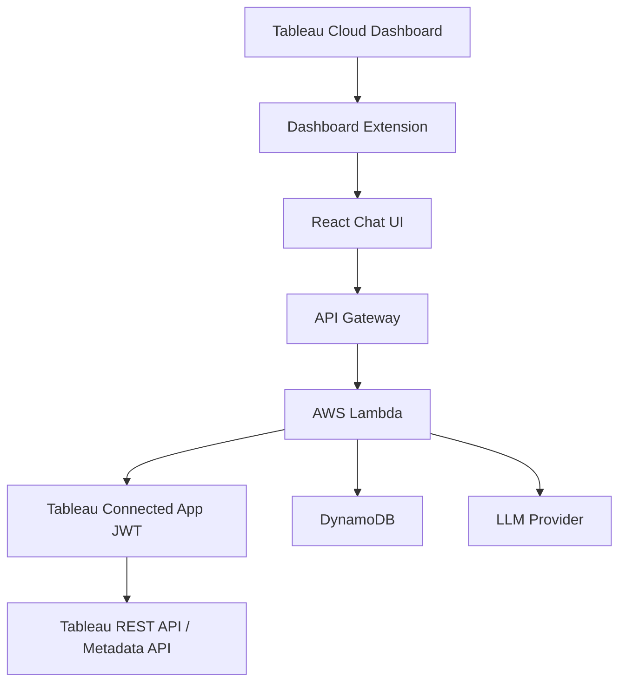

# Architecture / アーキテクチャ

## English

### Runtime Flow

1. Tableau loads the `.trex` manifest and opens the React app as a Dashboard Extension.
2. The React app initializes `tableau.extensions.initializeAsync()`.
3. The frontend captures safe dashboard metadata, such as dashboard name, worksheet names, filters, and parameters.
4. A user submits a question through the chat UI.
5. The frontend sends the question and dashboard context to `POST /chat`.
6. The Lambda handler validates the request and calls `ChatService`.
7. `ChatService` asks a `TableauContextProvider` for additional context.
8. The direct provider generates a Connected Apps JWT, signs in to Tableau REST API, and can query REST / Metadata APIs.
9. The answer generator returns a mock answer in this PoC.
10. Chat history is saved to DynamoDB or the in-memory local repository.

### Key Abstractions

- `TableauContextProvider`: hides whether Tableau context came from REST API, Metadata API, MCP, or mocks.
- `AnswerGenerator`: hides whether answers come from a mock, OpenAI, Bedrock, or another LLM.
- `ChatHistoryRepository`: hides whether history is saved in DynamoDB or memory.

## 日本語

### 実行時の流れ

1. Tableau が `.trex` manifest を読み込み、React アプリを Dashboard Extension として開きます。
2. React アプリが `tableau.extensions.initializeAsync()` を実行します。
3. フロントエンドがダッシュボード名、ワークシート名、フィルター、パラメーターなどの安全なメタデータを取得します。
4. ユーザーがチャットUIから質問を送信します。
5. フロントエンドが質問とダッシュボードコンテキストを `POST /chat` へ送信します。
6. Lambda ハンドラーがリクエストを検証し、`ChatService` を呼び出します。
7. `ChatService` が `TableauContextProvider` に追加コンテキスト取得を依頼します。
8. Direct provider は Connected Apps JWT を生成し、Tableau REST API にサインインして REST / Metadata API を呼び出せます。
9. この PoC では answer generator がモック回答を返します。
10. チャット履歴は DynamoDB またはローカル用 in-memory repository に保存されます。

### 主要な抽象化

- `TableauContextProvider`: Tableau コンテキスト取得元が REST API、Metadata API、MCP、モックのどれかを隠蔽します。
- `AnswerGenerator`: 回答生成元がモック、OpenAI、Bedrock、その他LLMのどれかを隠蔽します。
- `ChatHistoryRepository`: 履歴保存先が DynamoDB かメモリかを隠蔽します。

